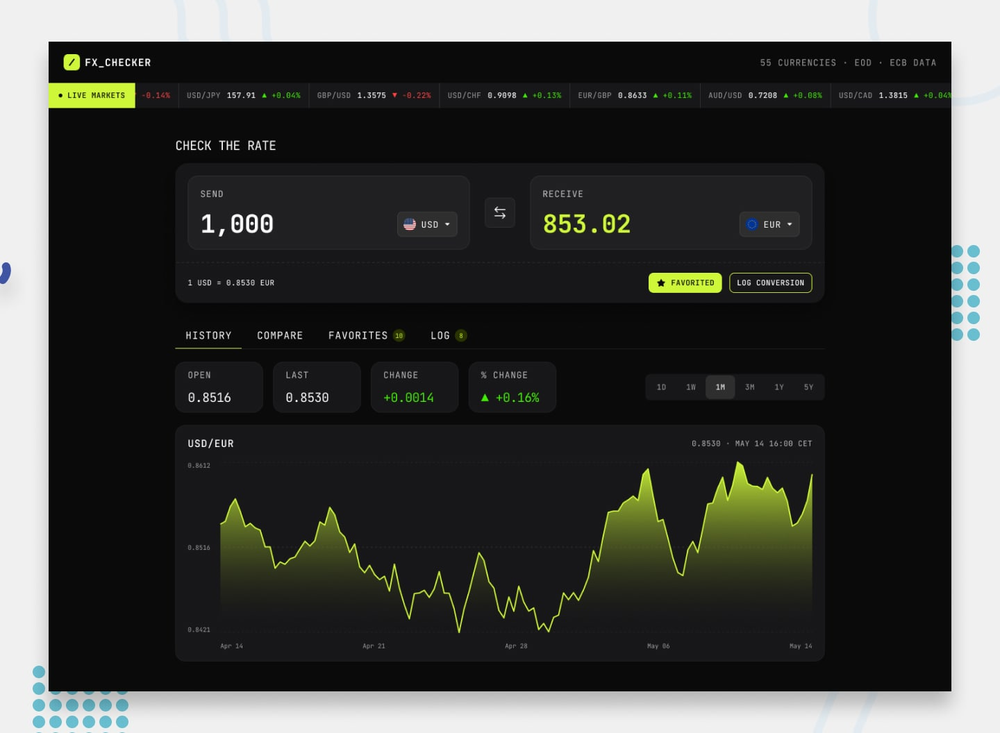

# FX Checker



A single-page currency converter with live rates, rate-history chart, multi-currency comparison, pinned favorites, and a conversion log.

Built as a submission for the [Frontend Mentor 30-Day Hackathon](https://www.frontendmentor.io/articles/fm30-hackathon-currency-converter).

## Stack

| Layer | Choice |
|-------|--------|
| **Framework** | React 19 |
| **Bundler** | Vite |
| **Language** | TypeScript |
| **Styling** | Tailwind CSS v4 |
| **UI Library** | shadcn/ui (Button, Tabs, Dialog, Badge, Input, Label) |
| **State** | Zustand |
| **Charts** | lightweight-charts (TradingView) |
| **API** | [Frankfurter](https://frankfurter.dev/) (free, no API key) |
| **Package manager** | pnpm |
| **Testing** | Vitest + Testing Library |

## Features

- **Converter** — real-time currency conversion with searchable currency picker
- **Live markets ticker** — scrolling rates with 24h change indicators
- **Rate history chart** — line + area chart with 1D/1W/1M/3M/1Y/5Y ranges
- **Multi-currency compare** — see your amount converted across currencies
- **Favorites** — pin pairs for quick access (persisted in localStorage)
- **Conversion log** — history with timestamps (persisted in localStorage)
- **Provider toggle** — switch between blended (84 central banks) and CBE (Central Bank of Egypt) data sources

## Getting started

```bash
pnpm install
pnpm dev
```
